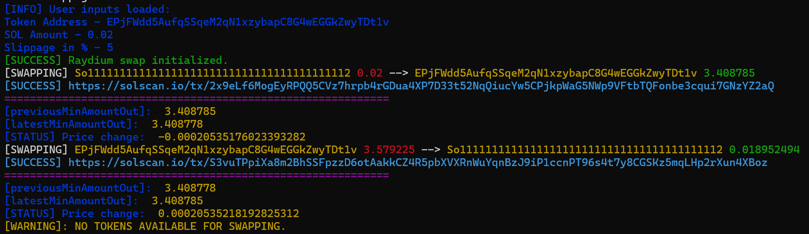

# SPL-Token Auto Buy & Sell

This automated script facilitates the swapping of targeted SPL-tokens and SOL on Raydium. Users can customize the script's parameters according to their preferences.
For testing purposes, the script can be set to simulate swaps by setting
`executeSwap: false` in `src/swapConfig.ts`.

## Requirements

- Node.js
- TypeScript
- Yarn

## Usage

1. **Environment Setup:**

   - Rename the existing `.env.example` file to `.env` or create a new `.env` file.
   - Populate the `.env` file with your keys:
     ```env
     RPC_URL=YOUR_RPC_URL
     WALLET_PRIVATE_KEY=YOUR_PRIVATE_KEY
     ```

2. **Configuration:**

   - Open `src/swapConfig.ts` to adjust the script parameters:

```ts
export const swapConfig = {
  executeSwap: true, // Send tx when true, simulate tx when false

  useVersionedTransaction: true, // wether you want to user versioned transaction or legacy transaction

  tokenAAddress: "So11111111111111111111111111111111111111112", // Token to swap for the other, SOL in this case

  maxLamports: 2000000, // Micro lamports for priority fee

  direction: "in" as "in" | "out", // Swap direction: 'in' or 'out'

  liquidityFile: "https://api.raydium.io/v2/sdk/liquidity/mainnet.json",

  OwnerAddress: "", // Your wallet PublicKey

  exitTarget: 1, // Exit target in percentage (e.g. +1%)

  maxRetries: 20,

  intervalMs: 4000, // Interval between every swap

  retryCount: 3, // Retry if the transaction fails.
};
```

3. **Installing Packages:**
   - To install neecessary packages run:
   ```bash
   yarn
   ```
4. **Execution:**
   - To run the script, execute the following command in the root directory:
   ```bash
   yarn swap
   ```

Example:

